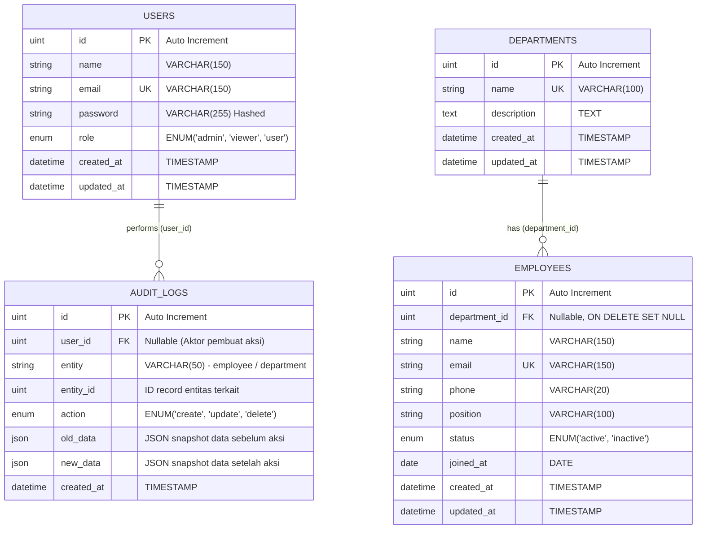

# 🏢 Employee Management System - Backend API

RESTful API untuk sistem manajemen karyawan modern berkinerja tinggi yang dibangun menggunakan **Go (Golang)**, framework **Fiber v2**, ORM **GORM**, dan database **MySQL**.

Sistem ini dirancang untuk bekerja secara mulus bersama frontend [Employee Management Frontend](https://github.com/saddmm/employee-management-fe).

---

## 🔗 Live Demo

| Layanan | Tautan | Keterangan |
| :--- | :--- | :--- |
| 🌐 **Live Demo Frontend** | [https://employee-management-fe-production.up.railway.app/](https://employee-management-fe-production.up.railway.app/) | Antarmuka web pengguna |
| 🚀 **Live Demo Backend API** | [http://employee-management-be-production-a8fc.up.railway.app/](http://employee-management-be-production-a8fc.up.railway.app/) | Base URL backend API |
| 📖 **Live Swagger UI** | [http://employee-management-be-production-a8fc.up.railway.app/api-documentation/](http://employee-management-be-production-a8fc.up.railway.app/swagger/) | Dokumentasi OpenAPI / Swagger interaktif |
| 🩺 **Health Check** | [http://employee-management-be-production-a8fc.up.railway.app/health](http://employee-management-be-production-a8fc.up.railway.app/health) | Status monitoring server |
| 📂 **Repositori Frontend** | [../employee-management-fe](../employee-management-fe) | Repositori antarmuka React + Vite |

---

## 🚀 Fitur Utama

- **Authentication & Role-Based Access Control (RBAC)**: Autentikasi berbasis JWT dengan role `admin` dan `viewer`.
- **Department Management**: Operasi CRUD untuk mengelola divisi kerja perusahaan.
- **Employee Management**: Operasi CRUD data karyawan dengan relasi langsung ke departemen, validasi server-side lengkap.
- **Server-Side Search, Filter, Sort & Pagination**: Seluruh pemrosesan pencarian, penyaringan departemen/status, dan pengurutan dinamis dieksekusi efisien di level query MySQL.
- **Audit Logging**: Pencatatan log otomatis setiap tindakan manipulasi data (Create, Update, Delete) lengkap dengan snapshot payload `old_data` dan `new_data`.
- **Export Data CSV**: Streaming ekspor seluruh atau sebagian data karyawan ke format `.csv` dengan tetap menghormati parameter filter/sort.
- **Security & Protection**: Dilengkapi Rate Limiting untuk perlindungan DDoS/brute force, CORS konfigurasi fleksibel, dan hashing password menggunakan bcrypt.
- **Database Auto-Migration & Seeding**: Skema tabel dan data permulaan dibuat otomatis ketika server dinyalakan.
- **Swagger Documentation**: Dokumentasi interaktif OpenAPI di `/swagger/` dan `/api-documentation`.

---

## 📊 Entity Relationship Diagram (ERD)

Berikut adalah diagram relasi data yang digunakan pada backend:



### Penjelasan Relasi:
1. **Departments ➔ Employees (1 to Many)**:
   - Satu departemen dapat menaungi banyak karyawan.
   - Kolom `department_id` bertindak sebagai foreign key nullable. Jika departemen dihapus, nilai pada karyawan otomatis diubah menjadi `NULL` (`ON DELETE SET NULL`) agar riwayat data karyawan tidak terhapus.
2. **Users ➔ Audit Logs (1 to Many)**:
   - Setiap aktivitas manipulasi data oleh pengguna tercatat pada tabel `audit_logs` melalui `user_id`.
3. **Audit Logs Polymorphic Target**:
   - Kolom `entity` mencatat nama tabel yang dipengaruhi (`employee` atau `department`), dan `entity_id` mencatat primary key dari data yang bersangkutan.

---

## 🛠️ Panduan Menjalankan di Lokal (Local Setup)

Aplikasi backend ini dapat dijalankan dengan database MySQL lokal **tanpa harus menggunakan Docker**, atau dapat pula menggunakan Docker Compose sesuai kenyamanan Anda.

### Prasyarat:
- **Go**: Versi 1.21 atau lebih baru (disarankan 1.25+)
- **Database MySQL / MariaDB**:
  - Pilihan A: MySQL lokal bawaan OS / XAMPP / MariaDB (Tanpa Docker).
  - Pilihan B: Docker & Docker Compose.

---

### Langkah 1: Siapkan Konfigurasi Environment (`.env`)

Salin file `.env.example` menjadi `.env`:

```bash
cp .env.example .env
```

Isi default pada `.env`:
```env
APP_ENV=development
APP_PORT=8080

DB_HOST=localhost
DB_PORT=3306
DB_USER=ems_user
DB_PASSWORD=ems_password
DB_NAME=employee_management

JWT_SECRET=your_super_secret_jwt_key_change_me_in_production
JWT_EXPIRE_HOURS=24

RATE_LIMIT_MAX=100
RATE_LIMIT_WINDOW_SEC=60
```

---

### Langkah 2: Setup Database MySQL

Pilih salah satu dari 2 metode di bawah:

#### Opsi A: Menggunakan MySQL Lokal (Tanpa Docker - XAMPP / Native MySQL)
Jika Anda sudah memiliki MySQL / MariaDB yang terpasang di komputer Anda (misalnya melalui XAMPP, Homebrew, atau service lokal):

1. **Pastikan service MySQL aktif**:
   - Linux: `sudo systemctl start mysql` atau `sudo systemctl start mariadb`
   - MacOS: `brew services start mysql`
   - Windows / XAMPP: Buka XAMPP Control Panel dan klik tombol **Start** pada MySQL.

2. **Buat Database Baru**:
   Buka terminal/konsol MySQL dan jalankan perintah:
   ```sql
   CREATE DATABASE employee_management CHARACTER SET utf8mb4 COLLATE utf8mb4_unicode_ci;
   ```

3. **Sesuaikan Kredensial di `.env`**:
   Buka file `.env` di folder backend dan sesuaikan dengan username serta password MySQL lokal Anda. Contoh jika menggunakan user `root` tanpa password (seperti standar XAMPP):
   ```env
   DB_HOST=127.0.0.1
   DB_PORT=3306
   DB_USER=root
   DB_PASSWORD=
   DB_NAME=employee_management
   ```
   *Catatan: Jika user root memiliki password, masukkan password tersebut pada `DB_PASSWORD`.*

#### Opsi B: Menggunakan Docker Compose (Alternatif Praktis)
Jika Anda lebih memilih menjalankan MySQL melalui Docker tanpa menginstall service MySQL di host:

```bash
docker compose up -d
```
Service MySQL akan berjalan otomatis di background pada port `3306` dengan konfigurasi yang cocok dengan isi default `.env.example` (`DB_USER=ems_user`, `DB_PASSWORD=ems_password`, `DB_NAME=employee_management`).

---

### Langkah 3: Download Dependensi & Jalankan Server

Jalankan perintah berikut:

```bash
# Unduh seluruh dependensi Go
go mod tidy

# Jalankan server
go run cmd/server/main.go
```

> **Catatan Otomatisasi (Auto-Migrate & Seed):**
> Saat server pertama kali berjalan, aplikasi akan secara otomatis:
> 1. Menjalankan **Auto-Migration** untuk membuat semua tabel (`users`, `departments`, `employees`, `audit_logs`).
> 2. Menjalankan **Database Seeder** untuk mengisi akun default, daftar departemen, dan 10 data sampel karyawan.
> Anda **tidak perlu mengimpor file SQL manual**.

Output yang muncul menandakan server telah aktif:
```text
Database connection established successfully
Running database migrations...
Database migration completed
Seeding initial data...
Server listening on http://localhost:8080
Swagger API documentation available at http://localhost:8080/api-documentation (or /swagger/)
```

Server dapat diakses di:
- **Base API**: `http://localhost:8080`
- **Swagger Documentation**: `http://localhost:8080/swagger/` atau `http://localhost:8080/api-documentation`
- **Health Check**: `http://localhost:8080/health`

---

## 👤 Akun Bawaan (Default Seed Data)

Telah disediakan dua akun siap pakai untuk pengujian hak akses:

| Role | Email | Password | Hak Akses |
| :--- | :--- | :--- | :--- |
| **Admin** | `admin@example.com` | `admin123` | Akses Penuh: CRUD Karyawan, CRUD Departemen, Akses Audit Log, Export CSV |
| **Viewer** | `viewer@example.com` | `viewer123` | Akses Terbatas (Read-Only): Melihat Karyawan, Melihat Departemen, Export CSV |

---

## 📡 Dokumentasi Endpoint API Lengkap

Semua endpoint dilindungi oleh header `Authorization: Bearer <token>` kecuali endpoint publik.

### 1. Health & Dokumentasi (Publik)

| Method | Endpoint | Hak Akses | Deskripsi |
| :--- | :--- | :--- | :--- |
| `GET` | `/health` | Publik | Cek kesehatan & status aktif server |
| `GET` | `/swagger/*` | Publik | Dokumentasi OpenAPI Swagger UI interaktif |
| `GET` | `/api-documentation` | Publik | Redirect cepat ke Swagger UI |

#### Contoh Response `GET /health`:
```json
{
  "service": "employee-management-be",
  "status": "ok",
  "timestamp": "2026-10-06T20:00:00Z"
}
```

---

### 2. Autentikasi (`/api/auth`)

| Method | Endpoint | Hak Akses | Deskripsi |
| :--- | :--- | :--- | :--- |
| `POST` | `/api/auth/register` | Publik | Mendaftarkan akun pengguna baru |
| `POST` | `/api/auth/login` | Publik | Login dengan email & password untuk mendapatkan JWT token |
| `GET` | `/api/auth/me` | Authenticated (`admin`, `viewer`) | Mengambil detail profil akun yang sedang login |

#### Contoh Body `POST /api/auth/login`:
```json
{
  "email": "admin@example.com",
  "password": "admin123"
}
```

#### Contoh Response Berhasil:
```json
{
  "data": {
    "token": "eyJhbGciOiJIUzI1NiIsInR5cCI6IkpXVCJ9...",
    "user": {
      "id": 1,
      "name": "Administrator",
      "email": "admin@example.com",
      "role": "admin"
    }
  },
  "message": "Login successful",
  "success": true
}
```

#### Contoh Body `POST /api/auth/register`:
```json
{
  "name": "John Doe",
  "email": "john.doe@example.com",
  "password": "password123"
}
```

---

### 3. Manajemen Departemen (`/api/departments`)

| Method | Endpoint | Hak Akses | Deskripsi |
| :--- | :--- | :--- | :--- |
| `GET` | `/api/departments` | Authenticated (`admin`, `viewer`) | Mengambil seluruh daftar departemen |
| `GET` | `/api/departments/:id` | Authenticated (`admin`, `viewer`) | Mengambil detail departemen berdasarkan ID |
| `POST` | `/api/departments` | **Admin Only** | Menambahkan departemen baru |
| `PUT` | `/api/departments/:id` | **Admin Only** | Memperbarui data departemen |
| `DELETE` | `/api/departments/:id` | **Admin Only** | Menghapus departemen berdasarkan ID |

#### Contoh Body `POST / PUT /api/departments`:
```json
{
  "name": "Quality Assurance",
  "description": "Software quality assurance and testing team"
}
```

---

### 4. Manajemen Karyawan (`/api/employees`)

| Method | Endpoint | Hak Akses | Deskripsi |
| :--- | :--- | :--- | :--- |
| `GET` | `/api/employees` | Authenticated (`admin`, `viewer`) | Daftar karyawan dengan filter, sort, dan pagination |
| `GET` | `/api/employees/:id` | Authenticated (`admin`, `viewer`) | Mengambil detail satu karyawan |
| `POST` | `/api/employees` | **Admin Only** | Menambahkan data karyawan baru |
| `PUT` | `/api/employees/:id` | **Admin Only** | Memperbarui data karyawan |
| `DELETE` | `/api/employees/:id` | **Admin Only** | Menghapus data karyawan |
| `GET` | `/api/employees/export/csv` | Authenticated (`admin`, `viewer`) | Mengunduh file laporan karyawan berformat CSV |

#### Parameter Query `GET /api/employees`:
- `page` *(integer, default: 1)*: Halaman aktif.
- `limit` *(integer, default: 10)*: Jumlah data per halaman.
- `search` *(string)*: Pencarian nama, email, atau posisi jabatan.
- `department_id` *(integer)*: Filter berdasarkan ID departemen.
- `status` *(string)*: Filter status (`active` / `inactive`).
- `sort_by` *(string, default: created_at)*: Kolom pengurutan (`name`, `email`, `position`, `status`, `joined_at`, `created_at`).
- `sort_order` *(string, default: desc)*: Urutan (`asc` / `desc`).

#### Contoh Response `GET /api/employees`:
```json
{
  "data": [
    {
      "id": 1,
      "department_id": 1,
      "department": {
        "id": 1,
        "name": "Engineering",
        "description": "Software engineering and technical infrastructure"
      },
      "name": "Sarah Connor",
      "email": "sarah.connor@example.com",
      "phone": "+1 555-0101",
      "position": "Principal Software Engineer",
      "status": "active",
      "joined_at": "2023-01-15T00:00:00Z",
      "created_at": "2026-10-06T19:00:00Z",
      "updated_at": "2026-10-06T19:00:00Z"
    }
  ],
  "meta": {
    "page": 1,
    "limit": 10,
    "total_records": 10,
    "total_pages": 1
  },
  "success": true
}
```

#### Contoh Body `POST /api/employees` & `PUT /api/employees/:id`:
```json
{
  "name": "Alice Johnson",
  "email": "alice.johnson@example.com",
  "phone": "+62 812-3456-7890",
  "position": "Senior Backend Engineer",
  "department_id": 1,
  "status": "active",
  "joined_at": "2024-03-01"
}
```

#### Parameter Query `GET /api/employees/export/csv`:
Mendukung filter yang sama dengan daftar karyawan (`search`, `department_id`, `status`, `sort_by`, `sort_order`). Response berupa file stream bertipe header `Content-Type: text/csv`.

---

### 5. Audit Logging (`/api/audit-logs`)

| Method | Endpoint | Hak Akses | Deskripsi |
| :--- | :--- | :--- | :--- |
| `GET` | `/api/audit-logs` | **Admin Only** | Riwayat log perubahan data entitas |

#### Parameter Query:
- `page` *(integer, default: 1)*: Halaman log.
- `limit` *(integer, default: 10)*: Batas jumlah log per halaman.
- `entity` *(string)*: Filter jenis entitas (`employee` atau `department`).
- `action` *(string)*: Filter tipe tindakan (`create`, `update`, `delete`).

#### Contoh Response:
```json
{
  "data": [
    {
      "id": 1,
      "user_id": 1,
      "user": {
        "id": 1,
        "name": "Administrator",
        "email": "admin@example.com",
        "role": "admin"
      },
      "entity": "employee",
      "entity_id": 1,
      "action": "create",
      "old_data": null,
      "new_data": "{\"name\":\"Alice Johnson\",\"email\":\"alice.johnson@example.com\",\"position\":\"Senior Backend Engineer\"}",
      "created_at": "2026-10-06T19:30:00Z"
    }
  ],
  "meta": {
    "page": 1,
    "limit": 10,
    "total_records": 1,
    "total_pages": 1
  },
  "success": true
}
```

---

## 🏗️ Struktur Direktori Proyek

```text
employee-management-be/
├── cmd/
│   └── server/
│       └── main.go              # Entrypoint aplikasi server
├── docs/                        # File spesifikasi Swagger OpenAPI
│   ├── docs.go
│   ├── swagger.json
│   └── swagger.yaml
├── internal/
│   ├── config/                  # Pemrosesan konfigurasi & env
│   ├── database/                # Koneksi DB, migration, & seeder
│   ├── handler/                 # Controller / HTTP Request Handlers
│   ├── middleware/              # JWT Auth, CORS, Logger, Rate Limiter, Error Handler
│   ├── model/                   # Definisi struktur GORM database model
│   ├── repository/              # Layer akses database
│   ├── router/                  # Definisi routing API & middleware grouping
│   └── service/                 # Business logic layer & audit logger integration
├── docker-compose.yml           # Konfigurasi container MySQL lokal
├── go.mod                       # Dependensi Go module
├── go.sum                       # Checksum dependensi Go
└── README.md                    # Dokumentasi backend ini
```

---

## 🤝 Repositori Terkait

Aplikasi ini merupakan bagian backend dari sistem Employee Management:
- **Frontend Web Repository**: [../employee-management-fe](../employee-management-fe)
- **Live Demo Frontend**: [https://employee-management-fe-production.up.railway.app/](https://employee-management-fe-production.up.railway.app/)
- **Live Demo Backend**: [http://employee-management-be-production-a8fc.up.railway.app/](http://employee-management-be-production-a8fc.up.railway.app/)
